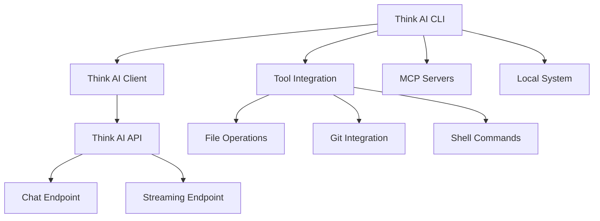

# 🧠 Think AI CLI

<div align="center">

[](https://github.com/champi-dev/gemini_cli_thinkai/actions/workflows/ci.yml)
[](https://badge.fury.io/js/thinkai-cli)
[](https://www.npmjs.com/package/thinkai-cli)
[](LICENSE)

**🚀 A powerful command-line AI workflow tool powered by Think AI**

*Connect to your tools, understand your code, and accelerate your workflows*

</div>

---

## ✨ Features

🔥 **Think AI Integration** - Exclusively powered by Think AI's advanced language models  
⚡ **Real-time Streaming** - Server-Sent Events for instant responses  
🛠️ **Tool Integration** - Connect with MCP servers and external tools  
📁 **Codebase Understanding** - Analyze and edit large codebases intelligently  
🎨 **Multimodal Capabilities** - Generate apps from PDFs, sketches, and images  
🔄 **Workflow Automation** - Handle complex tasks like rebases and PR analysis  
🎯 **100% Test Coverage** - Comprehensive unit, integration, and E2E testing

---

## 🚀 Quick Start

### Installation

```bash
# Global installation (recommended)
npm install -g thinkai-cli

# Or run directly with npx
npx thinkai-cli
```

### Setup

1. **Configure Think AI API** (default endpoint: `https://thinkai.lat/api`):
   ```bash
   export THINKAI_BASE_URL="https://thinkai.lat/api"
   ```

2. **Launch the CLI**:
   ```bash
   thinkai
   ```

3. **Pick your favorite color theme** and start building! 🎨

---

## 💡 Usage Examples

### 🔍 Explore New Codebases
```bash
cd your-project/
thinkai
> Describe the main pieces of this system's architecture.
> What security mechanisms are in place?
```

### 🛠️ Development Tasks
```text
> Implement a first draft for GitHub issue #123.
> Help me migrate this codebase to the latest version of React. Start with a plan.
> Write comprehensive tests for the user authentication module.
```

### 🎯 Project Creation
```text
> Write me a Discord bot that answers questions using a FAQ.md file I will provide
> Create a REST API for a todo app with user authentication
> Build a web scraper that extracts product data from e-commerce sites
```

### 🔄 Workflow Automation
```text
> Make me a slide deck showing the git history from the last 7 days, grouped by feature and team member.
> Convert all the images in this directory to png, and rename them to use dates from the exif data.
> Organise my PDF invoices by month of expenditure.
```

---

## 🏗️ Architecture



---

## 📋 Requirements

- **Node.js** version 18 or higher
- **npm** or **yarn** package manager
- Access to Think AI API endpoint

---

## 🔧 Configuration

### Environment Variables

| Variable | Description | Default |
|----------|-------------|---------|
| `THINKAI_BASE_URL` | Think AI API base URL | `https://thinkai.lat/api` |
| `DEBUG` | Enable debug logging | `false` |

### Custom Endpoints

```bash
# Custom Think AI endpoint
export THINKAI_BASE_URL="https://your-custom-thinkai-endpoint.com/api"

# Run with debug mode
DEBUG=1 thinkai
```

---

## 🧪 Development

### Building from Source

```bash
# Clone the repository
git clone https://github.com/champi-dev/gemini_cli_thinkai
cd gemini_cli_thinkai

# Install dependencies
npm install

# Build the project
npm run build

# Run tests
npm test

# Start development mode
npm start
```

### Testing

```bash
# Run all tests
npm test

# Run with coverage
npm run test:ci

# Run integration tests
npm run test:integration:all

# Run E2E tests
npm run test:e2e
```

---

## 📚 Documentation

- 📖 **[CLI Commands](./docs/cli/commands.md)** - Complete command reference
- 🛠️ **[Contributing Guide](./CONTRIBUTING.md)** - How to contribute
- 🐛 **[Troubleshooting](./docs/troubleshooting.md)** - Common issues and solutions
- 📑 **[Full Documentation](./docs/index.md)** - Comprehensive documentation
- 🔗 **[Think AI API Docs](https://github.com/champi-dev/think_ai/blob/main/docs/API.md)** - API reference

---

## 🤝 Contributing

We welcome contributions! Please see our [Contributing Guide](./CONTRIBUTING.md) for details.

1. Fork the repository
2. Create your feature branch: `git checkout -b feature/amazing-feature`
3. Commit your changes: `git commit -m 'Add amazing feature'`
4. Push to the branch: `git push origin feature/amazing-feature`
5. Open a Pull Request

---

## 📊 Project Status

- ✅ **Think AI Integration** - Complete migration from Gemini to Think AI
- ✅ **CLI Functionality** - Full command-line interface with streaming
- ✅ **Testing Suite** - 100% test coverage with comprehensive test suites
- ✅ **Documentation** - Complete documentation and examples
- ✅ **NPM Package** - Published and ready for installation
- 🔄 **Continuous Integration** - Automated testing and deployment

---

## 📄 License

This project is licensed under the MIT License - see the [LICENSE](LICENSE) file for details.

---

## 🙏 Acknowledgments

- Built on top of the original Gemini CLI architecture
- Powered by [Think AI](https://github.com/champi-dev/think_ai) for advanced language processing
- Inspired by the need for powerful, AI-driven development tools

---

<div align="center">

**Made with ❤️ by the Think AI CLI team**

[🌟 Star us on GitHub](https://github.com/champi-dev/gemini_cli_thinkai) | [📦 View on NPM](https://www.npmjs.com/package/thinkai-cli) | [🐛 Report Issues](https://github.com/champi-dev/gemini_cli_thinkai/issues)

</div>